# 🧮 Advanced Mathematical & Scientific Calculator


-brightgreen)


An all-in-one, feature-packed interactive Command-Line Interface (CLI) Calculator built in Python. Designed with robust input validation, fallback matrix algorithms, safe AST formula parsing, terminal ASCII function plotting, and 16 comprehensive mathematical modules.

---

## 🌟 Visual Application Flow

```mermaid
flowchart TD
    A[🚀 Calculator Main Menu] --> B1[1. Basic Arithmetic]
    A --> B2[2. Scientific & Hyperbolic]
    A --> B3[3. Programmer & Bitwise]
    A --> B4[4. Complex Numbers]
    A --> B5[5. AST Expression Evaluator]
    A --> B6[6. Matrix & Linear Algebra]
    A --> B7[7. Calculus & Equations]
    A --> B8[8. Geometry & Mensuration]
    A --> B9[9. ASCII Function Plotter]
    A --> B10[10. Date & Time Arithmetic]
    A --> B11[11. Unit & Currency Converters]
    A --> B12[12. Financial Calculations]
    A --> B13[13. Statistics & Regression]
    A --> B14[14. Probability & Randomness]
    A --> B15[15. Health & Fitness Metrics]
    A --> B16[16. History & Settings]
```



---

## ✨ Features Overview

### 1. 🧮 Basic & Scientific Mathematics
- **Arithmetic**: Addition (`+`), Subtraction (`-`), Multiplication (`*`), Division (`/`) with division-by-zero protection.
- **Powers & Roots**: Exponentiation ($x^y$), Square Roots ($\sqrt{x}$).
- **Logarithms**: Natural Log ($\ln x$), Base-10 ($\log_{10} x$), and Base-$b$ ($\log_b x$).
- **Combinatorics**: Factorial ($n!$), Permutations ($n\text{P}r$), Combinations ($n\text{C}r$), $\text{GCD}$, $\text{LCM}$.
- **Trigonometry**: $\sin$, $\cos$, $\tan$, $\arcsin$, $\arccos$, $\arctan$, $\sinh$, $\cosh$, $\tanh$.
- **Angle Units**: Instant toggle between **Degrees** and **Radians**.

### 2. 💻 Programmer & Bitwise Operations
- **Base Conversions**: Convert integer inputs seamlessly between **Decimal**, **Binary** (`0b`), **Hexadecimal** (`0x`), and **Octal** (`0o`).
- **Bitwise Logic**: `AND` (`&`), `OR` (`|`), `XOR` (`^`), `NOT` (`~`), Left Shift (`<<`), Right Shift (`>>`).

### 3. 🔢 Complex Number Arithmetic
- **Operations**: Full support for complex inputs ($a + bi$).
- **Properties**: Calculate Real/Imaginary parts, Magnitude $|z|$, Phase angle $\theta$, Complex conjugate $\bar{z}$, and Polar Form representation ($r \cdot e^{i\theta}$).

### 4. 📝 Safe AST Expression Evaluator
- Evaluates full mathematical expression strings (e.g., `(5 + 3) * 2^4`, `sin(pi/2) + sqrt(16)`).
- Employs Python's `ast` module to prevent unsafe code execution risks.
- Maintains session memory variables like `ans` (last result), `pi`, `e`.

### 5. 📐 Matrix & Linear Algebra
- Operations: Matrix Addition ($A + B$), Subtraction ($A - B$), Multiplication ($A \cdot B$), Transposition ($A^T$), Scalar Multiplication ($c \cdot A$).
- Linear Algebra: Matrix Determinant $\det(A)$, Matrix Inversion ($A^{-1}$), Eigensolver for Eigenvalues & Eigenvectors.
- Includes pure Python Gaussian & Gauss-Jordan elimination fallbacks for out-of-the-box operation without requiring `numpy`.

### 6. 📈 Calculus, Equation Solving & ASCII Plotting
- **Quadratic Solver**: Solve $ax^2 + bx + c = 0$ for real or complex roots.
- **Cubic Solver**: Solve $ax^3 + bx^2 + cx + d = 0$ using Cardano's trigonometric formulas.
- **Definite Integrals**: Compute $\int_a^b f(x) dx$ numerically via **Simpson's 1/3 Rule**.
- **Terminal ASCII Plotter**: Render 50x20 text-based graph plots of any function directly in the terminal!
- **Matplotlib Integration**: Optional graphical window plotting if `matplotlib` is installed.

```
ASCII Plot of f(x) = sin(x)  [y_max: 1, y_min: -1]
+-------------------------------------------------------+
|                          |*                          *|
|                          |  *                      *  |
|                          |    **                **    |
|                          |      *              *      |
|                          |        **        **        |
|                          |          *      *          |
|--------------------------+-----------*----*-----------|
|          *      *        |                            |
|        **        **      |                            |
|      *              *    |                            |
|    **                **  |                            |
|  *                      *|                            |
|*                         |                            |
+-------------------------------------------------------+
 x: -3.1415                                     x: 3.1415
```

### 7. 📏 Geometry & Mensuration
- **2D Shapes**: Circle (Area, Circumference), Triangle (Base/Height & Heron's formula), Rectangle, Regular $N$-sided Polygon.
- **3D Solids**: Sphere, Cylinder, Cone, Rectangular Prism (Volume & Surface Area).

### 8. 📅 Date & Time Arithmetic
- **Date Difference**: Calculate exact days, hours, and working business days (Monday-Friday) between two dates.
- **Date Adjustment**: Add or subtract days/weeks from any starting date.

### 9. 🔄 Unit & Currency Converters
- **Unit Conversions**: Length (m, km, cm, mm, miles, feet, inches), Mass (kg, g, lbs, oz, tons), Temperature (°C, °F, K), Volume (L, mL, gallons, cups).
- **Real-Time Currency Converter**: Fetches live exchange rates via ExchangeRate API with fallback snapshot rates for offline execution.

### 10. 💵 Financial Calculations
- **Compound Interest**: Future value $A = P(1 + r/n)^{nt}$ and interest breakdown.
- **Loan / Mortgage**: Monthly payment $M$ estimation and total interest calculation.
- **Net Present Value (NPV)**: Discounted cash flow investment evaluation.

### 11. 📊 Statistics & Linear Regression
- **Descriptive Statistics**: Count, Mean, Median, Mode, Variance, Sample/Population Standard Deviation, Range.
- **Linear Regression**: Best-fit line equation ($y = mx + b$), Slope $m$, Intercept $b$, Pearson correlation $r$, $R^2$.

### 12. 🎲 Probability & Randomness
- **Dice Roller**: Roll $N$ dice with $S$ sides ($NdS$).
- **Coin Flipper**: Flip $N$ coins with statistical percentage output.
- **Password Generator**: Generate cryptographically secure passwords using standard library `secrets`.
- **Sampling**: Random sample and shuffle utilities.

### 13. 🏋️ Health & Fitness Metrics
- **Body Mass Index (BMI)**: Score calculation and WHO health classification.
- **BMR & TDEE**: Basal Metabolic Rate via Mifflin-St Jeor formula and Total Daily Energy Expenditure by activity multiplier.

---

## ⚡ Quick Start

### Prerequisites
- Python 3.10 or higher.
- Zero external dependencies required (uses Standard Library out of the box).
- *(Optional)* `numpy`, `sympy`, `matplotlib` for enhanced matrix/calculus/plotting windows.

### Running the Calculator

```bash
python Calculator.py
```

---

## 🛠️ Tech Stack & Architecture

- **Language**: Python 3.10+
- **Parsing**: `ast` (Abstract Syntax Tree)
- **Math Engine**: `math`, `cmath`, `statistics`
- **Networking**: `urllib.request`, `json`
- **Security**: `secrets` module
- **Testing**: `unittest` test suite

---

## 📜 License
This project is open-source and available under the [MIT License](LICENSE).
