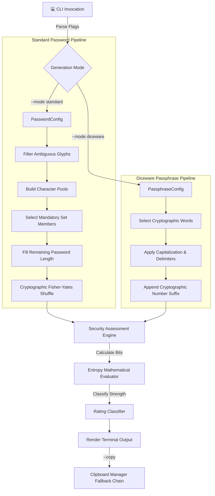

<div align="center">

# 🔐 Cryptographically Secure Password & Passphrase Generator
### *Enterprise-Grade, PEP 8 Compliant, Non-Deterministic CLI Application*


-red.svg?style=for-the-badge&logo=securityscorecard)


</div>

---

## 🧊 3D Cyber Vault & Security Flow

```
                 ____________________________________________________
                /                                                    \
               |   [🛡️ NON-DETERMINISTIC CRYPTOGRAPHIC VAULT]        |
               |                                                    |
               |       entropy(E) = Length(L) * log2(Pool(R))        |
               \____________________________________________________/
                                          |
                                          v
   +-----------------------+   +-----------------------+   +-----------------------+
   |  [🎲 Standard Pool]   |   |  [📖 Diceware Dict]   |   | [🚫 Ambiguous Filter] |
   |  A-Z, a-z, 0-9, !@#   |   |  250+ Curated Words   |   |  Excludes: l, 1, I, O  |
   +-----------------------+   +-----------------------+   +-----------------------+
               |                           |                           |
               +---------------------------+---------------------------+
                                           |
                                           v
                        +-------------------------------------+
                        |  [⚡ Secrets Fisher-Yates Shuffle]  |
                        | Non-deterministic array permutation |
                        +-------------------------------------+
                                           |
                                           v
                        +-------------------------------------+
                        |   [📊 Entropy & Strength Engine]    |
                        |   Weak | Moderate | Strong | V.Strong|
                        +-------------------------------------+
                                           |
                                           v
                        +-------------------------------------+
                        |    [📋 System Clipboard / CLI]      |
                        |   Zero Echo Terminal Security       |
                        +-------------------------------------+
```

---

## 🌟 Visual Architecture Overview



---

## ✨ Features Breakdown

### 🎲 1. Standard Cryptographic Password Generator
- **Secrets-Only RNG**: Powered strictly by Python's `secrets` module (`secrets.choice`, `secrets.randbelow`). Completely bypasses predictable pseudo-random number generators (`random`).
- **Strict Set Compliance**: Guarantees that every generated password contains at least **one character** from each active character pool (uppercase, lowercase, numbers, special symbols).
- **Ambiguous Character Excluder (`--exclude-ambiguous`)**: Removes easily confused characters (`l, 1, I, O, 0, B, 8, S, 5, Z, 2, i, !, |`) to prevent typographic login mistakes in printed or terminal environments.
- **Configurable Length**: Scalable length between **8 and 128 characters** (default: 16).

### 📖 2. Diceware Passphrase Generator
- **Human-Rememberable Security**: Generates high-entropy passphrases composed of memorable words from an embedded **~250-word curated dictionary**.
- **Custom Delimiters**: Supports any custom word separator (`-`, `.`, `_`, `/`, space).
- **Word Transformations**: Option to `--capitalize` each word (Title Case) and append random 2-digit numbers (`--add-number`).

### 🛡️ 3. Mathematical Entropy Assessment Engine
- Calculates exact theoretical entropy in bits ($E$) using the formula:
  $$E = L \times \log_2(R)$$
  *Where $L$ is password length / word count, and $R$ is character pool size / wordlist length.*

- **Strength Rating Categories**:
  | Entropy Range | Strength Rating | Security Guidance |
  | :--- | :--- | :--- |
  | **$< 40$ Bits** | `Weak` | ⚠️ Vulnerable to automated offline brute-force dictionary attacks. |
  | **$40 - 59$ Bits** | `Moderate` | 🟡 Suitable for low-risk online accounts. |
  | **$60 - 79$ Bits** | `Strong` | 🟢 Suitable for primary email and personal logins. |
  | **$\ge 80$ Bits** | `Very Strong` | 🔵 Enterprise security standard (Cryptographically Resilient). |

### 📋 4. Cross-Platform Clipboard Security
- Use the `--copy` flag to copy output directly to the system clipboard without leaving sensitive plain-text passwords in your terminal history buffer.
- **Graceful Fallback Chain**:
  $$\text{pyperclip} \longrightarrow \text{Windows } \texttt{clip} \longrightarrow \text{macOS } \texttt{pbcopy} \longrightarrow \text{Linux } \texttt{xclip}$$

### 🧪 5. Self-Contained Unit Test Suite
- Full test coverage built directly into `Passwordgenrator.py`.
- Execute via `--test` flag or standard `unittest` module runner.

---

## 💻 Installation & Quickstart

### 1. Prerequisites
No external dependencies required! Uses Python 3.10+ standard libraries (`secrets`, `dataclasses`, `argparse`, `math`, `unittest`).

### 2. Execution Commands

```bash
# Clone or navigate to the project directory
cd "Practice/Python/50 Mini Projects"

# Run unit tests to verify system integrity
python Passwordgenrator.py --test
```

---

## 🚀 Usage Examples & CLI Command Cheat Sheet

### 1. Standard High-Security Password (16 chars, copied to clipboard)
```bash
python Passwordgenrator.py --copy
```
**Output:**
```text
=================================================================
      SECURE CRYPTOGRAPHIC PASSWORD GENERATOR (PEP 8)
=================================================================

[01] Generated Password : jU?lDS:7(pRsj#}k
     Length             : 16 characters
     Pool Size          : 88 distinct characters
     Theoretical Entropy: 103.35 bits
     Security Rating    : Very Strong -> [#] Enterprise security standard (Cryptographically Resilient).

[+] Successfully copied item [01] (16 chars) to system clipboard!
```

---

### 2. Custom 24-Character Password Excluding Ambiguous Characters
```bash
python Passwordgenrator.py -l 24 --exclude-ambiguous -n 3
```
**Output:**
```text
=================================================================
      SECURE CRYPTOGRAPHIC PASSWORD GENERATOR (PEP 8)
=================================================================

[01] Generated Password : bszvJCtPTR.7h.cNqu,q#9mK
     Length             : 24 characters
     Pool Size          : 73 distinct characters
     Theoretical Entropy: 148.56 bits
     Security Rating    : Very Strong -> [#] Enterprise security standard (Cryptographically Resilient).

[02] Generated Password : 33Ef9s&(vA;eqpnDq9nM*2kL
     Length             : 24 characters
     Pool Size          : 73 distinct characters
     Theoretical Entropy: 148.56 bits
     Security Rating    : Very Strong -> [#] Enterprise security standard (Cryptographically Resilient).

[03] Generated Password : s4*Dp$$JG-yKn?p37,bL^8wQ
     Length             : 24 characters
     Pool Size          : 73 distinct characters
     Theoretical Entropy: 148.56 bits
     Security Rating    : Very Strong -> [#] Enterprise security standard (Cryptographically Resilient).
```

---

### 3. Diceware Passphrase Mode
```bash
python Passwordgenrator.py --mode diceware --words 5 --delimiter "." --capitalize --add-number -n 2
```
**Output:**
```text
=================================================================
      SECURE CRYPTOGRAPHIC PASSWORD GENERATOR (PEP 8)
=================================================================

[01] Generated Passphrase: Clover.Shield.Typhoon.Waterfall.Hero.50
     Word Count          : 5 words
     Wordlist Size       : 266 distinct words
     Theoretical Entropy : 46.92 bits
     Security Rating     : Moderate -> [*] Acceptable for low-risk online accounts.

[02] Generated Passphrase: Tornado.Tapestry.Granite.Titan.Timber.13
     Word Count          : 5 words
     Wordlist Size       : 266 distinct words
     Theoretical Entropy : 46.92 bits
     Security Rating     : Moderate -> [*] Acceptable for low-risk online accounts.
```

---

## 🎛️ Complete CLI Arguments Reference

| Argument Flag | Type | Default | Description |
| :--- | :--- | :--- | :--- |
| `--mode` | Choice | `standard` | Generation mode: `standard` or `diceware`. |
| `-l`, `--length` | Integer | `16` | Password length for standard mode ($8 - 128$). |
| `-n`, `--count` | Integer | `1` | Number of passwords/passphrases to generate. |
| `--no-upper` | Flag | `False` | Exclude uppercase characters (`A-Z`). |
| `--no-lower` | Flag | `False` | Exclude lowercase characters (`a-z`). |
| `--no-digits` | Flag | `False` | Exclude numerical digits (`0-9`). |
| `--no-symbols` | Flag | `False` | Exclude special symbols (`!@#$%...`). |
| `--exclude-ambiguous` | Flag | `False` | Exclude ambiguous characters (`l, 1, I, O, 0, B, 8...`). |
| `--words` | Integer | `4` | Number of words for Diceware passphrase ($3 - 20$). |
| `--delimiter` | String | `"-"` | Separator character between Diceware words. |
| `--capitalize` | Flag | `False` | Capitalize the first letter of each Diceware word. |
| `--add-number` | Flag | `False` | Append a random 2-digit number to the passphrase. |
| `--copy` | Flag | `False` | Copy generated password to system clipboard automatically. |
| `--test` | Flag | `False` | Execute the embedded `unittest` suite and exit. |

---

## 🏗️ Class Architecture & Design Patterns

```
Passwordgenrator.py
│
├── ⚙️ PasswordConfig (Dataclass: length, toggles, ambiguous flag)
├── ⚙️ PassphraseConfig (Dataclass: word_count, delimiter, caps, add_num)
│
├── 🔐 CryptographicRNG (secrets wrapper: choice, secure_shuffle)
├── 🎲 PasswordGenerator (Strict set compliance, pool filtering, generator)
├── 📖 DicewareGenerator (Word selection, transformation, generator)
│
├── 📊 SecurityAssessmentEngine (Entropy calculation & strength classifier)
├── 📋 ClipboardManager (Cross-platform clipboard fallback handler)
│
└── 🧪 TestPasswordGenerator (Embedded unit test suite)
```

---

## 🧪 Running Unit Tests

```bash
python Passwordgenrator.py --test
```
*Output:*
```text
.......
----------------------------------------------------------------------
Ran 7 tests in 0.001s

OK
[+] Running Cryptographic Password Generator Unit Test Suite...
```

---

<div align="center">

Made with ❤️ using **Python Standard Library** | Cryptographically Secure & PEP 8 Compliant

</div>
