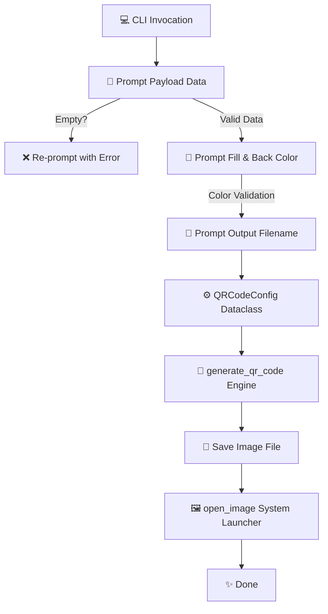

<div align="center">

# 📱 Modular Python QR Code Generator
### *Customizable, PEP 8 Compliant, Production-Grade QR Generator & Viewer*


</div>

---

## 📐 Architecture & Flowchart

```
                 ____________________________________________________
                /                                                    \
               |        [📱 MODULAR QR CODE PIPELINE]                |
               |                                                    |
               |       Config -> Input Validation -> PIL Render      |
               \____________________________________________________/
                                          |
                                          v
   +-----------------------+   +-----------------------+   +-----------------------+
   | [🔗 Payload Parser]   |   | [🎨 Color Validator]  |   | [📁 Path Normalizer]  |
   | Text / URL Payload    |   | Hex & Named RGB tuple |   | Auto .png Extension   |
   +-----------------------+   +-----------------------+   +-----------------------+
               |                           |                           |
               +---------------------------+---------------------------+
                                           |
                                           v
                        +-------------------------------------+
                        |     [⚡ QRCode Matrix Engine]       |
                        |   Auto Version & Error Correction  |
                        +-------------------------------------+
                                           |
                                           v
                        +-------------------------------------+
                        |      [🎨 Pillow Image Render]       |
                        | Custom Fill & Background Colors     |
                        +-------------------------------------+
                                           |
                                           v
                        +-------------------------------------+
                        |    [🖼️ OS Default Viewer Launcher]  |
                        | Auto-opens image upon completion    |
                        +-------------------------------------+
```

---

## 🌟 Visual Architecture Overview



---

## ✨ Features

- **Dataclass-Driven Modular Architecture**: Uses `QRCodeConfig` and decoupled helper functions for clean reusability.
- **Robust Input Validation**: Re-prompts on empty text/URL payloads with clear error messages.
- **Dynamic Color Customization**: Supports color names (`black`, `navy`, `crimson`) and hex codes (`#003366`) via Pillow `ImageColor`.
- **Automatic Extension & Directory Resolution**: Automatically appends `.png` if absent and creates target output directories.
- **Cross-Platform Auto-Open**: Uses native OS handlers (`os.startfile` on Windows, `open` on macOS, `xdg-open` on Linux) with PIL fallback.
- **Built-in Automated Test Suite**: Embedded unit testing executable via `--test`.

---

## 🚀 Quick Start

### 1. Requirements

Install required dependencies:

```bash
pip install qrcode pillow
```

### 2. Running the Application

Execute the script interactively:

```bash
python Qrcodegenrator.py
```

### 3. Running Unit Tests

To run the embedded unittest suite:

```bash
python Qrcodegenrator.py --test
```

---

## 🧪 Example Output

```text
=================================================================
           📱 MODULAR PYTHON QR CODE GENERATOR 📱          
=================================================================
Generate high-quality custom QR codes effortlessly!

Enter text or URL to encode into QR code: https://github.com
Enter fill color (e.g., 'black', 'blue', '#003366') [Default: 'black']: #003366
Enter background color (e.g., 'white', 'yellow', '#FFFFFF') [Default: 'white']: white
Enter output file name [Default: 'qrcode.png']: my_github_qr.png

⏳ Generating QR code with parameters:
   • Content Payload: https://github.com
   • Fill Color:     #003366
   • Background:     white
   • Output Target:  my_github_qr.png

✅ QR code successfully generated and saved to:
   c:\Users\LOKI\Practice\Python\50 Mini Projects\my_github_qr.png

🖼️ Opening generated image...
✨ Image opened in system default viewer.
```
