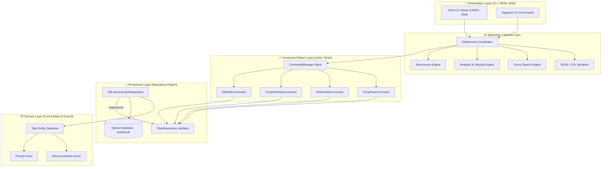
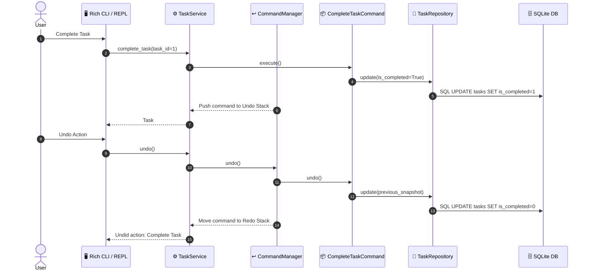
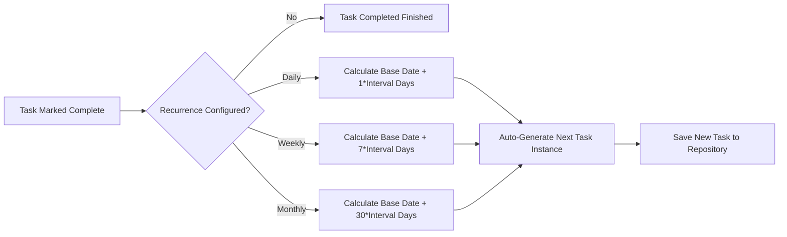

# 🚀 Advanced Enterprise To-Do List Application


An enterprise-grade, clean-architecture To-Do List application written in Python. Built adhering strictly to SOLID design principles, standard design patterns (Repository Pattern, Command Pattern for Undo/Redo), rich terminal user interface components, SQLite SQLAlchemy ORM persistence, subtask dependency chains, a task recurrence engine, JSON/CSV import/export, and productivity analytics.

---

## 🌟 Visual Architecture & Diagrams

### 1. Clean Layered Architecture Overview



---

### 2. Command Pattern Undo / Redo Lifecycle



---

### 3. Task Recurrence Engine Flowchart



---

## 🎨 Rich Terminal UI Mockups

### Active Task Table View
```text
                                  To-Do List                                   
┌────┬────────┬─────────────────────────────┬──────────┬───────────┬──────────────┬────────────┬────────────┐
│ ID │ Status │ Title                       │ Priority │ Category  │ Tags         │  Due Date  │ Recurrence │
├────┼────────┼─────────────────────────────┼──────────┼───────────┼──────────────┼────────────┼────────────┤
│ 1  │  [v]   │ Finalize Q3 Financial Plan  │  URGENT  │ Work      │ report, q3   │ 2026-08-10 │ weekly (1) │
│ 2  │  [x]   │ Buy Office Supplies         │  MEDIUM  │ Personal  │ shopping     │ 2026-08-12 │    -       │
│ 3  │  [x]   │ Daily Standup Meeting       │   HIGH   │ Work      │ agile, team  │ 2026-08-07 │ daily (1)  │
└────┴────────┴─────────────────────────────┴──────────┴───────────┴──────────────┴────────────┴────────────┘
```

### Subtask & Dependency Tree View
```text
Task #1: Finalize Q3 Financial Plan [URGENT]
├── [v] #4: Gather Expenses Sub-report [HIGH]
├── [x] #5: Audit Revenue Numbers [URGENT]
└── [x] #6: Draft Executive Summary [MEDIUM] (Blocked by #5)
```

### Productivity Dashboard & Analytics
```text
┌───────────────────────────── Productivity Dashboard ─────────────────────────────┐
│ Total Tasks: 12                                                                 │
│ Completed: 8                                                                    │
│ Pending: 4                                                                      │
│ Overdue: 1                                                                      │
│ Due Today: 2                                                                    │
│ Velocity (7 Days): 6 tasks completed                                            │
└─────────────────────────────────────────────────────────────────────────────────┘
Completion Rate [============================================        ] 66.7%
```

---

## ⚡ Feature Matrix

| Feature | Description | Technical Implementation |
| :--- | :--- | :--- |
| **Clean Architecture** | Decoupled presentation, domain, service, and data layers | SOLID principles & Repository Pattern |
| **Command Pattern (Undo/Redo)** | Full undo and redo capabilities for all task operations | `ICommand` ABC with `CommandManager` stack |
| **SQLAlchemy Persistence** | Robust SQLite database storage with auto-schema creation | SQLAlchemy 2.0 ORM + `TaskModel` mapping |
| **Dependency Chain Control** | Blocks task completion if prerequisite tasks remain incomplete | Foreign ID list verification in `TaskService` |
| **Recurrence Engine** | Auto-schedules next task instance upon completing repeating task | `RecurrenceEngine` date math (Daily, Weekly, Monthly) |
| **Categorization & Multi-Tagging**| Color-coded priorities (`LOW`, `MEDIUM`, `HIGH`, `URGENT`), categories, & tags | Python dataclass + JSON serialized set fields |
| **Fuzzy Title Search** | Intelligent text searching with ratio threshold matching | `difflib.SequenceMatcher` |
| **Import / Export** | Complete database import & export capabilities | Standard JSON & CSV handlers with validation |
| **Productivity Analytics** | Real-time stats, 7-day velocity, overdue alerts, completion rate | `AnalyticsEngine` + Rich visual Progress bar |
| **Rich Terminal REPL & CLI** | Colorful tables, status icons, subtask trees, and interactive shell | `rich` library console components & `argparse` |
| **Automated Testing** | Comprehensive unit & integration tests | `pytest` runner integrated in `ToDoList.py` |

---

## 🛠️ Installation & Setup

### Prerequisites
- **Python 3.10+** installed on your system.

### Install Dependencies
```bash
pip install rich sqlalchemy pytest
```

---

## 📖 Command Reference

### Direct CLI Commands

```bash
# 1. Add a new task
python ToDoList.py add "Buy Groceries" --priority HIGH --category Personal --tags shopping,food --due 2026-08-10 --recurrence weekly

# 2. List all tasks (with optional category or tag filtering)
python ToDoList.py list
python ToDoList.py list --category Work
python ToDoList.py list --tag shopping

# 3. Complete a task by ID
python ToDoList.py complete 1

# 4. Soft-delete a task
python ToDoList.py delete 2

# 5. Search tasks using fuzzy matching
python ToDoList.py search "Groceries"

# 6. Display productivity analytics & completion rate
python ToDoList.py analytics

# 7. Export task database to JSON or CSV
python ToDoList.py export --format json --output my_tasks.json
python ToDoList.py export --format csv --output my_tasks.csv

# 8. Import tasks from JSON or CSV file
python ToDoList.py import --format json --input my_tasks.json

# 9. Run automated unit test suite
python ToDoList.py test
```

### Interactive REPL Shell Mode

Launch the full interactive shell mode:
```bash
python ToDoList.py shell
```

**Interactive Menu Options:**
- `[1] List Tasks` - Render colorized table of active tasks
- `[2] Add Task` - Interactive wizard for task parameters
- `[3] Complete Task` - Mark done and auto-trigger recurrence
- `[4] Delete Task` - Soft-delete task
- `[5] Search Tasks` - Instant fuzzy title search
- `[6] Analytics` - Display productivity dashboard & progress meters
- `[7] Export Data` - Export to JSON or CSV
- `[8] Import Data` - Load external JSON or CSV task files
- `[9] Undo Action` - Undo last command in stack
- `[10] Redo Action` - Redo previously undone action
- `[0] Exit` - Close shell session

---

## 🧪 Automated Testing

To execute the embedded pytest test suite:
```bash
python -m pytest ToDoList.py -v
```

**Test Suite Coverage:**
- `test_task_domain_entity`: Domain entity calculations and overdue logic
- `test_repository_crud`: SQLAlchemy repository CRUD, update, and soft-delete
- `test_command_pattern_undo_redo`: Command Pattern undo and redo stack behavior
- `test_dependency_blocking`: Dependency blocking rules
- `test_recurrence_engine`: Recurrence date generation engine
- `test_json_import_export`: JSON serialization and import/export integrity

---

## 📄 License
Distributed under the MIT License. See `LICENSE` for details.
